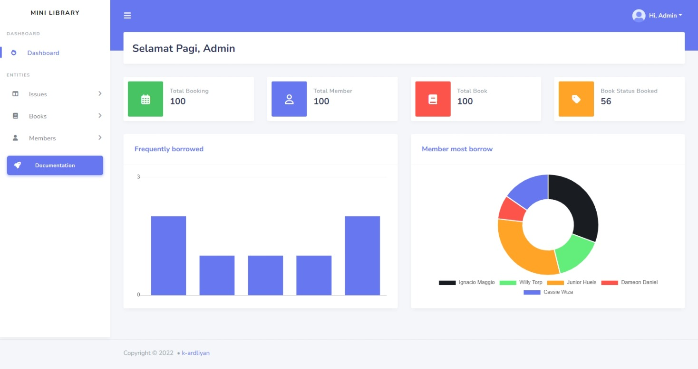

# Mini Libary with Laravel 6

as the name suggests this is an application like a library but with a super small scope.


## Screenshots




## Features

- Laravel 6
- Responsive
- Minimalist


## Installation

Step by step install my-project

Clone this repository into your local server

```bash
  git clone https://github.com/k-ardliyan/laravel-gamelab.git
  cd laravel-gamelab
```
    
Then, install laravel project with this command

```bash
  composer install
  npm run && npm dev
```

After that setup .env laravel

```bash
  copy .env.example .env
  php artisan key:generate
  php artisan storage:link
```

When everything is done, then just setup the database on .env

```env
  DB_CONNECTION=mysql
  DB_HOST=127.0.0.1
  DB_PORT=3306
  DB_DATABASE=laravel-gamelab #the name of the database you have created
  DB_USERNAME=root
  DB_PASSWORD=
```

Congratulations on running my demo project.

